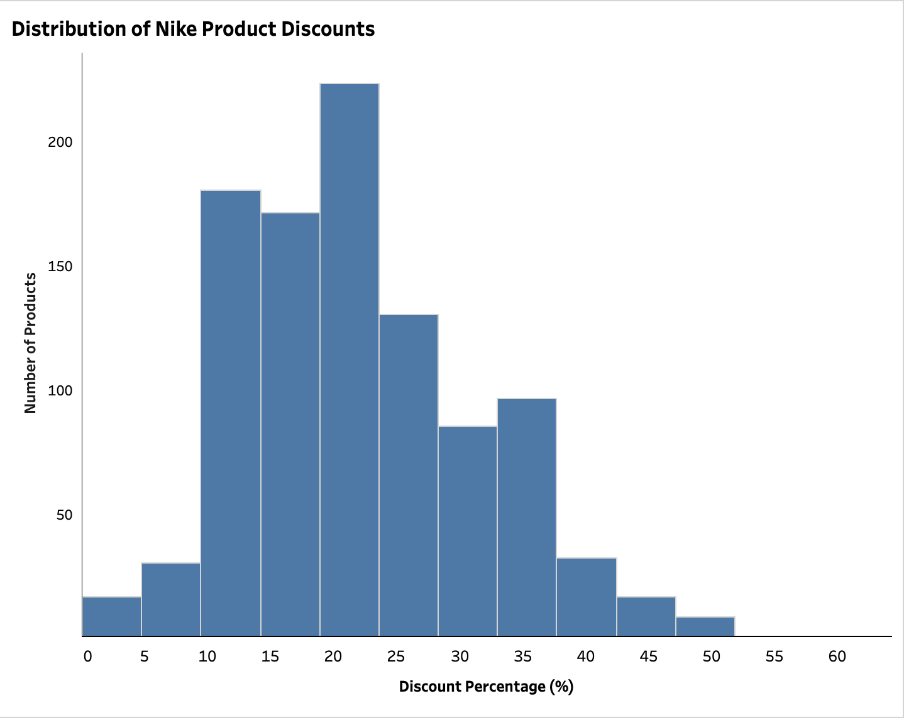
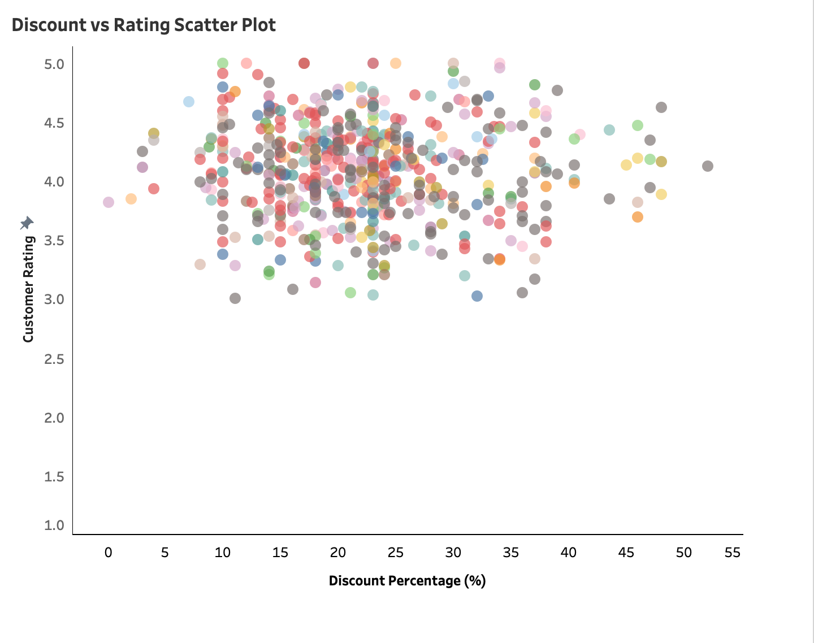
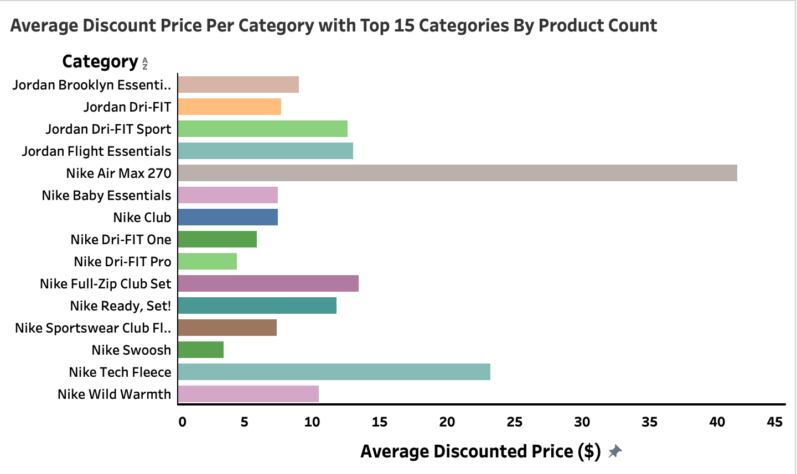
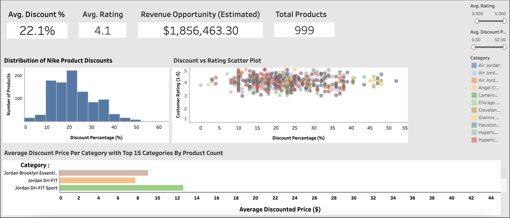

# Nike-Discount-Analysis

This project analyzes Nike product discount data to understand pricing strategies, customer sentiment, and revenue opportunities. Using Tableau and structured data analysis techniques, the project delivers an executive-style KPI dashboard that summarizes key business insights for decision-makers.

The goal is to demonstrate real-world data analyst skills, including:

* Data cleaning & preparation

* KPI definition

* Exploratory data analysis

* Data visualization & storytelling

* Executive dashboard design

## 🛠️ Tools & Technologies

* Tableau – Dashboard design & visualization

* Excel / CSV – Data preparation

* SQL (PostgreSQL) – Data exploration & transformations

* GitHub – Version control & project presentation

## 📂 Dataset Description

| Column               | Description                                           |
| -------------------- | ----------------------------------------------------- |
| Product Name         | Name of the Nike product                              |
| Category             | Product category (e.g., Jordan, Apparel, Accessories) |
| Original Price       | Original retail price                                 |
| Discounted Price     | Price after discount                                  |
| Discount Percent     | Percentage discount applied                           |
| Rating               | Average customer rating (1–5)                         |
| Review Count         | Number of customer reviews                            |
| Estimated Units Sold | Simulated sales volume for revenue analysis           |

## 📊 Executive KPI Dashboard

The final output of this project is a Nike Product Discount Analytics Dashboard, which includes:

### 🔑 Key Performance Indicators (KPIs)

* Average Discount % – Overall discount strategy level

* Average Customer Rating – Product satisfaction across discounts

* Total Products – Dataset coverage

* Estimated Revenue Opportunity – Discount-driven revenue potential

### 📈 Visualizations

1. 
    * Identifies common discount ranges and outliers

2. 
    * Analyzes the relationship between discount depth and ratings

3. 
    * Compares pricing strategies across product categories

### Dashboard

* 
    - Displays three charts and four KPIs in the dashboard

* 

## 👤 Author
Meraj Nushin
Bachelor’s in Computer Science
